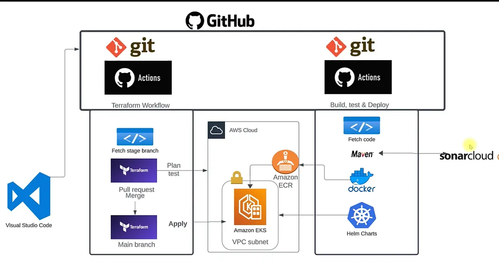
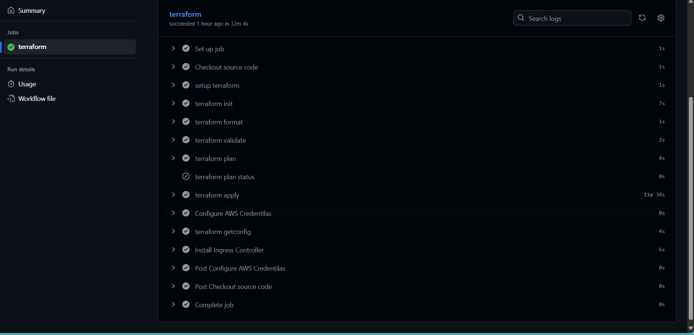
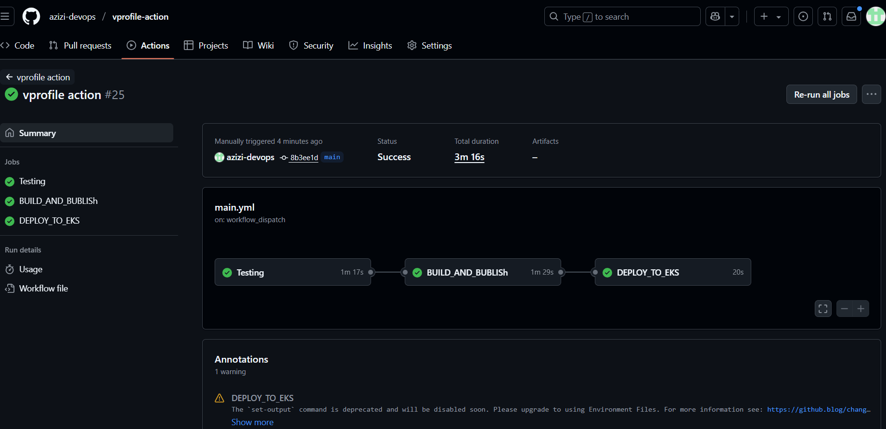

# Prerequisites
#####
- JDK 11
- Maven 3
- MySQL 8 

# Technologies 
- Spring MVC
- Spring Security
- Spring Data JPA
- Maven
- JSP
- MySQL
# Database
Here,we used Mysql DB 
MSQL DB Installation Steps for Linux ubuntu 14.04:
- $ sudo apt-get update
- $ sudo apt-get install mysql-server

Then look for the file :
- /src/main/resources/db_backup.sql
- db_backup.sql file is a mysql dump file.we have to import this dump to mysql db server
- > mysql -u <user_name> -p accounts < db_backup.sql

##########################################################################
# GitOps in Action: CI/CD Deployment to Amazon EKS Using Terraform & GitHub Workflows

## 🌍 End-to-End GitOps Deployment on Amazon EKS – Live on a Custom Domain!

This project demonstrates a **complete GitOps workflow** to deploy a Java web application to an **Amazon EKS** cluster.  
The CI/CD pipeline is fully automated with **GitHub Actions**, following a **two-repository strategy**:
- **Infrastructure Repository** (Terraform) – for AWS resources.

- **Application Repository** – for app code, Docker build, and Helm deployment.

👉 The application is deployed live on a custom domain:  
**http://vprofile.hkhinfocenter.xyz**  

---

## ⚙️ Tech Stack Highlights
- **Terraform** – Provisioned AWS infrastructure using IaC  
- **AWS EKS** – Managed Kubernetes cluster  
- **AWS ECR** – Secure Docker image storage  
- **Docker** – Containerized the Java application  
- **Maven** – Build and test automation for Java  
- **SonarCloud** – Code quality and security analysis  
- **Helm** – Kubernetes package management  

---

## 🏗️ Project Architecture

### 📁 1. Infrastructure Repository (Terraform)
- Provisions AWS resources:
  - VPC, subnets, security groups, IAM roles, and the EKS cluster.
- **GitHub Actions Workflows:**
  - On **push to staging** → Runs `terraform fmt`, `validate`, and `plan`.
  - On **merge to main** → Runs `terraform apply` to deploy infrastructure.
- Installs Kubernetes tools and configures the **NGINX Ingress Controller**.

### 📁 2. Application Repository
- Contains:
  - Java application code  
  - Dockerfile  
  - Helm chart  
- **CI/CD Workflow:**
  1. **Test** – Runs Maven build and unit tests; sends results to SonarCloud.  
  2. **Build & Publish** – Builds Docker image and pushes to AWS ECR.  
  3. **Deploy** – Uses Helm to deploy the app to the EKS cluster.  

---

## 🌐 Public Access with Custom Domain + Ingress
To expose the app publicly:
- ✅ Created **Ingress Resource** (`vproingress.yaml`) with nginx Ingress class.  
- ✅ Configured **subdomain routing** → `vprofile.hkhinfocenter.xyz` (GoDaddy).  
- ✅ DNS Settings:
  - Created **CNAME record** in GoDaddy.  
  - Pointed it to the **Load Balancer DNS** from the Ingress controller.  

📡 Once pipeline completed, app was **live at**:  
👉 http://vprofile.hkhinfocenter.xyz  

---

## 🎯 Key Learnings
- GitOps principles for CI/CD automation.  
- Infrastructure provisioning with Terraform.  
- Kubernetes deployments with Helm.  
- End-to-end automation using GitHub Actions.  
- Domain management and DNS routing for production apps.  

---

## 📂 Source Code Repositories
- **Infrastructure (Terraform):** [iac-vprofile](https://github.com/azizi-devops/iac-vprofile)  
- **Application Code & CI/CD:** [vprofile-action](https://github.com/azizi-devops/vprofile-action)  

---
✨ This project highlights how to build a **fully automated, production-grade GitOps pipeline** with Terraform, GitHub Actions, and Amazon EKS.
